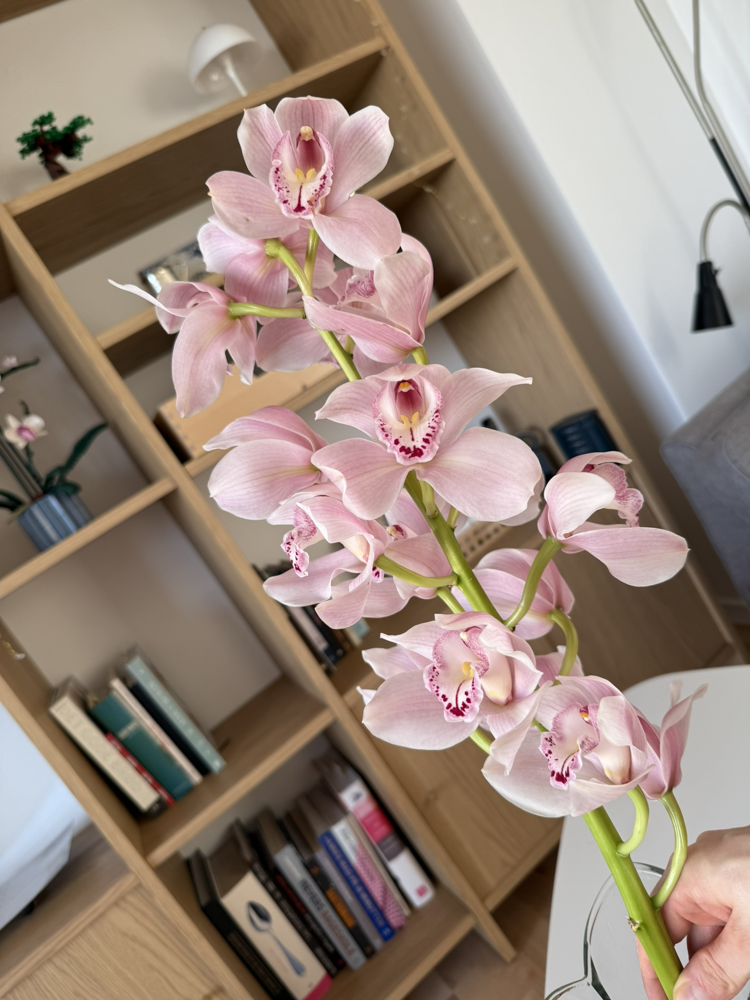

A plain text logbook is very "Internet circa 1995", but we are 40 years further along the journey. We live in a visual world, where a picture is worth a thousand words. Therefore, and because even I run around with a smartphone in my pocket and take pictures of all kinds of things, the logbook must support images. This is what was implemented today.

The first picture is of an orchid branch that I received for my birthday last year. I love orchids, and if I do say so myself, they seem to like me back. They certainly seem happy to bloom in my care.

Furthermore, like this logbook, the branch consists of many beautiful flowers, each lovely in its own right, but together they become something greater than the sum of their individual parts. That is my goal for this little corner of the website.

Perhaps most importantly, it will always remind me of a certain special someone who gave it to me.

Small update: Playing around with design choices can be both fun and frustrating at the same time. Fun because it is easy to experiment and the results are immediate; frustrating because there is no objectively correct answer. Everything depends on judgement and intuition. As a natural scientist, that does not come naturally to me.