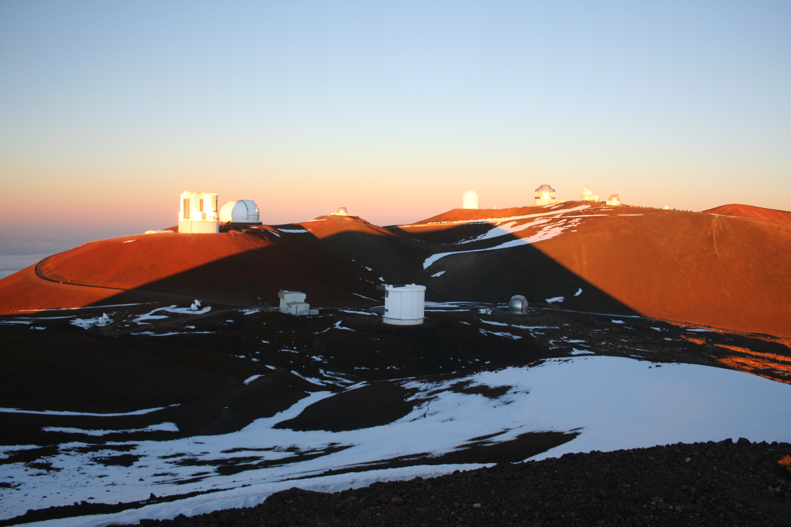

---
title: Testing Working Copy
date: 2026-07-26
—--

Working with Working Copy is very easy and straightforward. The installation went well, and so did connecting to the GitHub repository. One of my minor annoyances yesterday was not haven autocorrect, which Working Copy does. However, that comes with a catch: in Markdown, the frontmatter is written within - - -, and autocorrect of course concatenates them to a single em-dash. The workaround: write the dashes with spaces in between and then go back and delete the spaces. That works. 

Uploading an image was ridiculously simple and straightforward. I could either import directly from the iPad Photos app, or I could convert the image to JPEG format myself and then import the file. 

This picture is from the top of Mauna Kea, Hawaii. Not necessarily the first thing that comes to mind when thinking about Hawaii, except if you’re an astronomer - or a former astronomer. The conditions for making astronomical observations up here are some of the best in the world. And imagine, it is possible to go straight from a white sandy beach and palm trees to freezing cold and snow in just a couple of hours. Definitely one of my favorite places in the world! 
