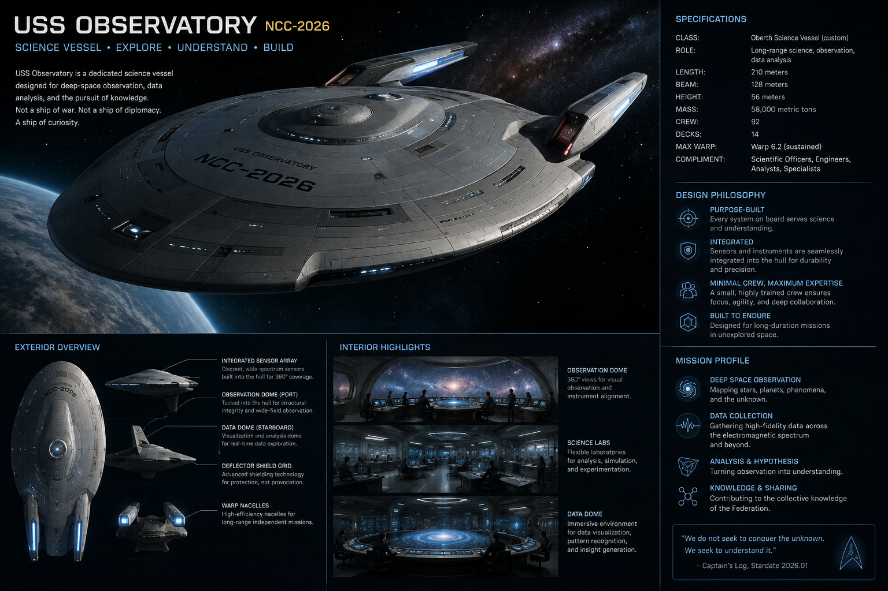

The day began with a fun thought experiment: what if the Observatory were a Star Trek starship? What would it look like? The result is surprisingly convincing:

It is definitely a place I could imagine living and working, at the edge of explored space, devoted to science and exploration.

Returning to development, we continued building the Projects section of the Observatory. We now have a working landing page, which will eventually host all projects, along with metadata such as their purpose, start date, and the number of related observations.

We also gave the individual project pages a major overhaul. Surprisingly, most of our time was spent on something that cannot really be measured: how a page *feels* to read. Does the text flow naturally? Do the different sections stand apart clearly enough? Or does everything blend together?

There is no objectively correct answer. The goal is not perfection, but coherence. Every design decision should make the Observatory feel a little more like home.

Today felt like an important step. We started with imagination and ended with philosophy. Somewhere in between, the Observatory became a little more itself.

I have a feeling these discussions will continue for quite some time, and I hope they do. After all, this is not just a website. It is my digital home, and designing it turns out to be just as rewarding as building it.