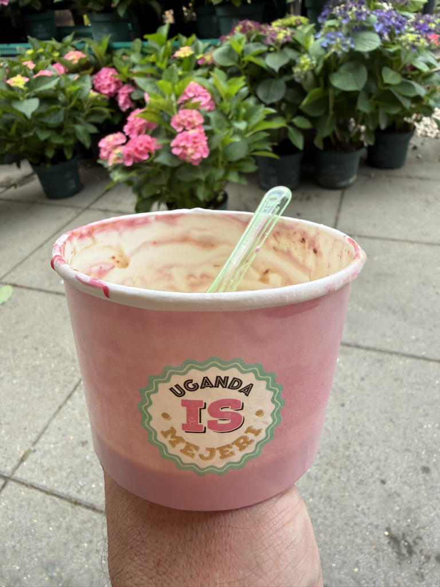

I started Training. Not as in *I started to train*, no, I started building the Training page under Engineering, which will be one of the core pages of the Observatory. We are of course breaking it down into smaller pieces, but starting work on that page is a huge step forward. Over the coming days and weeks, expect to see visualisations and other fun stuff appearing.

We did start the day, however, by fixing a small item that had been lying dormant for a couple of weeks: setting up a proper RSS feed for the individual Logbook pages in the Observatory. This is now implemented and working.

We had also discussed whether to bundle individual observations into folders with their associated content files. However, as I usually only upload an image or two, and I am strict about naming them consistently, there is little benefit to doing so at the moment. Should the need arise at some point in the future, we will deal with it then.

Although I am back at work, summer isn't over yet, and we spent part of the day getting ice cream at one of the absolute best places in Copenhagen: Uganda Ismejeri. The name has nothing to do with the country; the ice cream shop is simply located on Ugandavej.

I completely forgot to take a picture of the actual ice cream because it was so good, so you will have to make do with the empty cup...

Back home, we started identifying the primary components of the Training page: goals, current focus, performance, motivation, and the context surrounding my training. We then built the first underlying data model, which can already distinguish between strength goals and skills and keep track of when goals are achieved.

So Training has officially begun. Stay tuned!