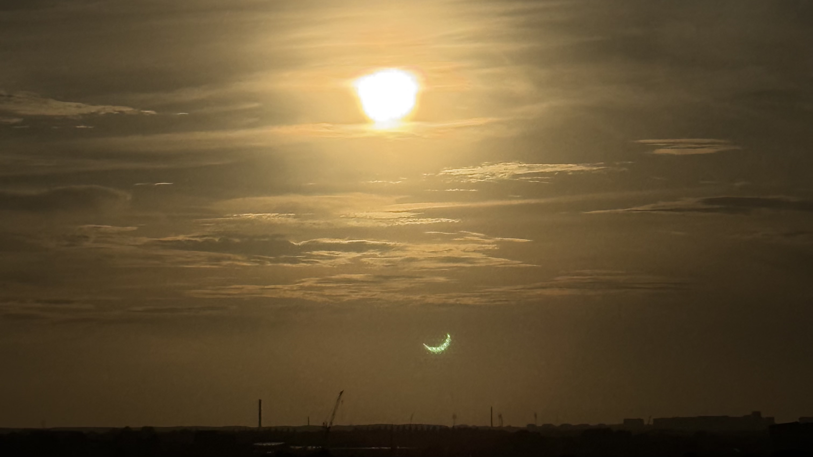

Tonight there was a partial solar eclipse in Copenhagen, with more than 80% of the Sun hidden behind the Moon. It was magnificent to follow from my own homemade solar observatory, consisting of two pieces of paper: one with a small hole in it, placed in front of the other. The light is very special during such a celestial event.

While I was running back and forth to my seventh-floor balcony to watch the eclipse, I also managed to import the first Training data into Observatory. Not quite as spectacular an event in the grand scheme of things, but still a small step forward.

I now have a data model where I can export my training log from a Numbers file to CSV and read the raw data into Observatory. From there, the data are filtered and normalised into a clean performance dataset containing only the things I actually recorded: date, exercise, weight, reps, and RPE. Derived metrics such as estimated one-rep max can then be calculated by Observatory itself.

This is the first step towards creating some hopefully stunning visualisations, and that was quite enough for today.

I had a terrible night's sleep, just like two nights ago, so productivity and, more importantly, creativity were down today. Furthermore, despite speaking so highly of training motivation yesterday, there was simply no physical energy this morning to go to the gym.

Tomorrow. Because I can, and I will. Just keep showing up.