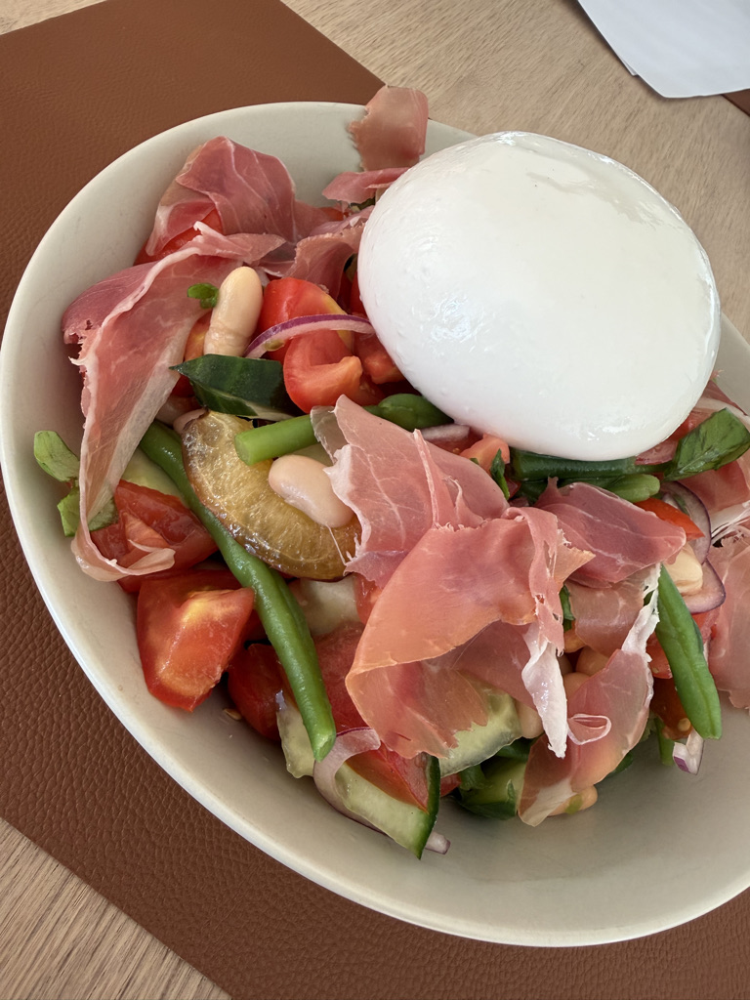

Summer is definitely not over yet! Today we reached a high of 28°C, which is not too bad for the season. Dinner needed to be light, filling, tasty and easy to make, because, once again, work ran a little late. 

Dinner ended up becoming a rustic tomato salad with white and green beans, cucumber, red onions, lots and lots of fresh basil, topped with prosciutto and a giant ball of burrata. I of course ended up spending an hour cutting the cucumbers and tomatoes so they were just the right kind of "accidental" rustic, but it worked. The reason? There was a secret ingredient: fresh sweet little plums from the island of Langeland. That combination was to die for. 

Yesterday we decided what the first Training visualisations should show. Today, we started building them.

The first addition is a set of three Performance cards for squat, bench press, and deadlift. Each card shows three different views of the same exercise: my current estimated strength, defined as the highest e1RM recorded during the latest 28-day training window; my actual one-repetition PR and the date I first achieved it; and my current goal.

This distinction turns out to be quite useful. An estimated 1RM describes what I should currently be capable of based on recent training, whereas a PR records something I have actually done. For example, my current deadlift e1RM is 160.3 kg, while my actual one-repetition PR is 147.5 kg and my current goal is 150 kg. Those three numbers tell a much more interesting story together than any of them would alone.

The cards themselves ended up deliberately simple: three columns, restrained typography, and thin separator lines. No boxes, shadows, gradients, icons, or other dashboard decoration. They fit the visual language of Observatory surprisingly well.

I also finally dealt with the disproportionately large Motivation section. The first paragraph now remains visible, while the rest can be expanded under *Why I keep showing up*. It preserves the purpose of the section without allowing it to dominate the entire Training page.

Tomorrow is Copenhagen Pride, so Observatory gets the day off. On Sunday, we return to Training and start working on the actual visualisations.