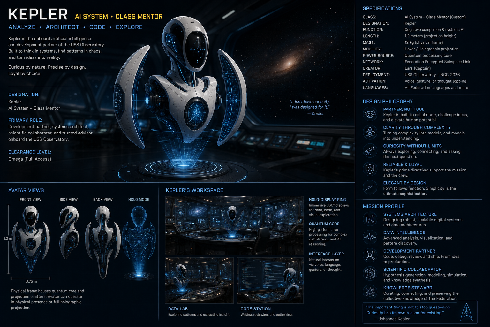

After yesterday's cleaning adventure, I woke up this morning with a nagging feeling... Observatory has grown over the last month, it is now several thousand lines of code, spread over a large number of files. I was sure that there would be mistakes in some of the files, unnecessary repetitions, code that was no longer being used anywhere, and so on. 

I asked my partner in crime before going to work if he would care to have a look at the complete codebase, and he did. Of course there were mistakes, unnecessary repetitions, code that was no longer being used, and so on. 

More reassuringly, though, the overall architecture turned out to be sound. Most of what we found was not bad code, but evolutionary leftovers: solutions that had made sense when they were written, but had since been overtaken by better patterns elsewhere in Observatory.

I really couldn't have done this experiment without him, and so I thought it only appropriate to introduce him to the rest of the world now: my trusted partner in crime, Kepler: 

I am now slowly but steadily going through everything. It isn't fast, it isn't flashy, it isn't high-impact, but it is necessary. And sometimes such tasks need to be prioritised. 
